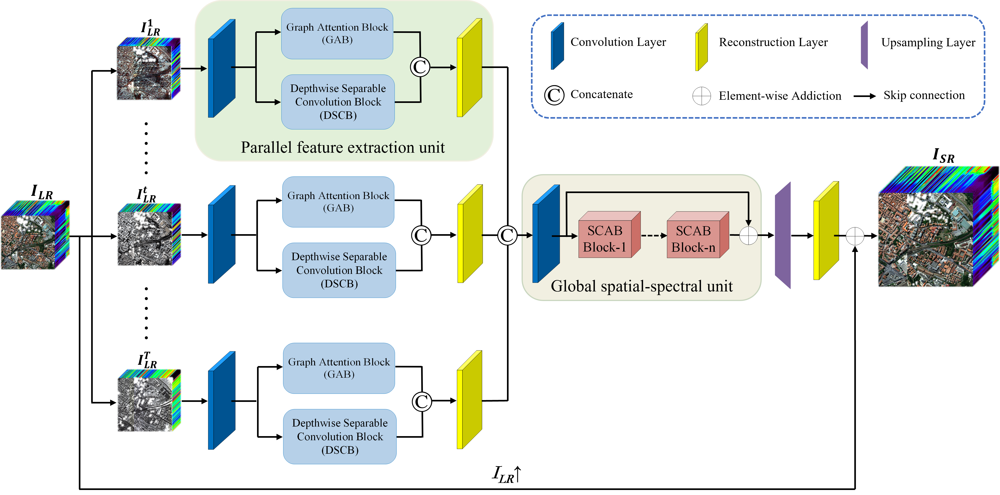
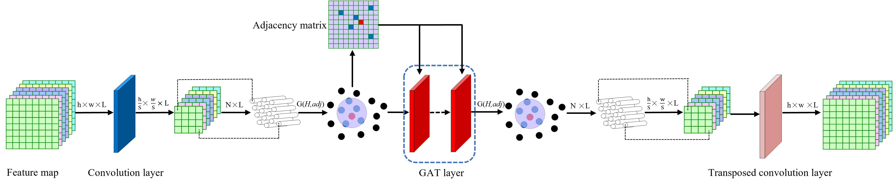
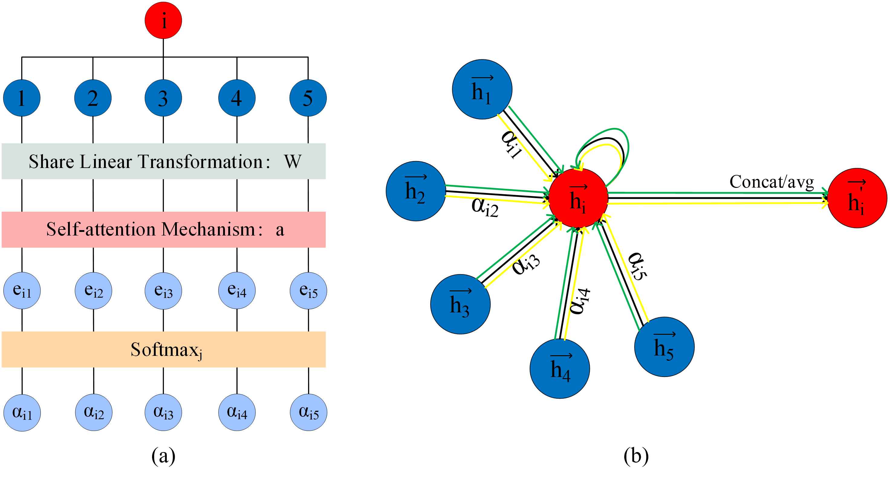
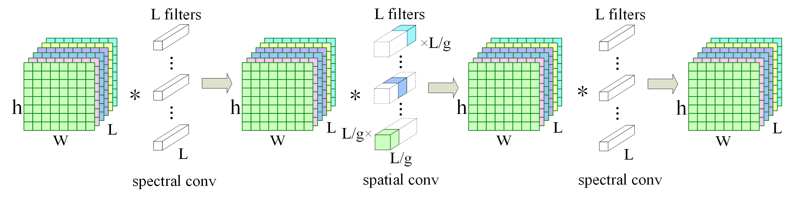
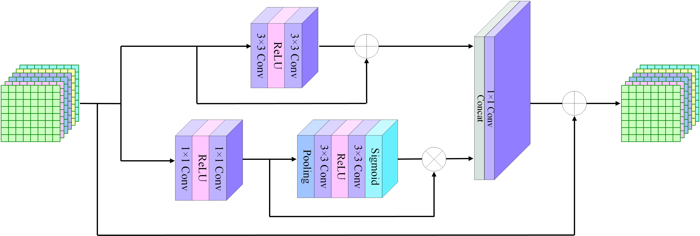

# CEGATSR
Implementation of CNN-Enhanced Graph Attention Network for Hyperspectral Image Super-Resolution Using Non-Local Self-Similarity (CEGATSR) in Pytorch.

The small-sample problem that widely existed in the hyperspectral image (HSI) super-resolution task will lead to insufficient feature extraction in network training. Therefore, it is necessary to design an effective network to extract the feature of HSIs fully. In addition, existing HSI super-resolution (SR) networks usually capture multiple receptive fields by staking massive convolutions, which will inevitably produce many parameters. In this paper, we propose a novel HSI SR network based on the convolution neural network enhanced graph attention network (CEGATSR), which can fully capture different features by using a graph attention block (GAB) and a depthwise separable convolution block (DSCB). Moreover, the graph attention block can also capture different receptive fields by using relatively few layers. Specifically, we first divide the whole spectral bands into several groups and extract the features separately for each group to reduce the parameters. Secondly, we design a parallel feature extraction unit to extract non-local and local features by combining the graph attention block (GAB) and the depthwise separable convolution block (DSCB). The graph attention block makes full use of the non-local self-similarity strategy not only to self-learn the effective information but also to capture the multiple receptive fields by using relatively few parameters. The depthwise separable convolution block is designed to extract the local feature information with few parameters. Thirdly, we design a spatial-channel attention block (SCAB) to capture the global spatial-spectral features and to distinguish the importance of different channels.

## Network Architecture
- The overall network architecture of our proposed CEGATSR network

   
   
- Parallel Feature Extraction Unit
   
  - The **Non-Local** network architecture of the Graph Attention Block (GAB)

    

    - The Graph Attention Layer (a) and Multi-Head Graph Attention Layer (b) of the Graph Attention Block (GAB)

      

  - The **Local** network architecture of the Depthwise Separable Convolution Block (DSCB)
      
      

- Global Spatial-Spectral Unit : Spatial-Channel Attention Block (SCAB)
  
    

## Dependencies

```
cuda==11.4
numpy==1.15.0
python==2.6.1
scipy==1.1.0
tensorboard==2.0.2
tensorboardX==2.4
thop==0.1.0.post2206102148
torch==1.7.1
torchvision==0.8.2
visdom==0.1.8.9
```

## Installation&Run
- Clone this repo:
```bash
git clone https://github.com/Dongyx1128/CEGATSR
cd CEGATSR
```

- Train the model
```bash
sh train.sh
```

- Test the model
```bash
sh test.sh
```

## Citation
```
@article{dyx2022CEGATSR,
author = {Cong Liu and Yaxin Dong},
title = {CNN-Enhanced graph attention network for hyperspectral image super-resolution using non-local self-similarity},
journal = {International Journal of Remote Sensing},
volume = {43},
number = {13},
pages = {4810-4835},
year  = {2022},
publisher = {Taylor & Francis},
doi = {10.1080/01431161.2022.2121188},
URL = {https://doi.org/10.1080/01431161.2022.2121188},
eprint = {https://doi.org/10.1080/01431161.2022.2121188}
```

## Acknowledgments
This research was supported by the National Natural Science Foundation of China (No.61703278).
